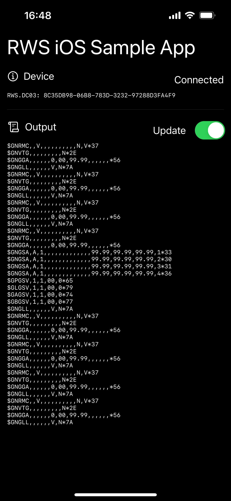

#  Drogger iOS (iPhone / iPad)サンプルアプリケーション

このサンプルはDrogger RWSシリーズおよびRZXシリーズを利用するためサンプルアプリケーションです。
Xcode 14 および iOS 17 での動作確認をしております。

## ライセンス
このアプリケーションのソースコードはパブリック・ドメインでご自由にお使いいただけます。
ご自由にコピーして製品にご利用ください。

## iOSからDroggerにBluetooth接続するための準備
iOSとDroggerを接続するには準備が必要です。Droggerはいくつかのファームウェアがあり、そのなかで **BLE** に対応したファームウェアをDroggerに書き込む必要があります
初期状態のファームウェアでは Bluetooth Classic Serial Port Profile を用いていますがiOSではこのプロファイルの利用ができない(※1)ためです。

ファームウェア変更にはAndroid端末と [Drogger GPS アプリ](https://play.google.com/store/apps/details?id=jp.bizstation.drgps&hl=ja) が必要となります

※1 正確にはMade For iPhone認証が必要となります。主に一般消費者向けの認証ですが、Droggerは業務用製品であり対応予定はありません。

## 実行方法
通常のiOSアプリと同様にXcodeで本サンプルを開き、ビルドして実行してください。いくつか注意点があります。

- 実機でのみ実行可能。simulatorはBluetoothに対応していません。
- 本サンプルプロジェクトアプリではなく新規/既存アプリに追加する場合にはいくつか設定が必要です
  - CoreBluetooth.frameworkの追加
  - Info.plistでのBluetooth利用宣言と用途の説明 (`NSBluetoothAlwaysUsageDescription`など)。詳しくは "Info.plist Bluetooth" 等で検索してください。

## コードの解説
BLEを利用する一般的なコードと近いものとなっています。BLEの利用方法については各種ドキュメントをご確認ください。

### Droggerの検出

Drogger端末の検出には次のようなコードを利用します。

`name.starts(with: "RWS") || name.starts(with: "RZS")`

BLEで検出可能な機器は弊社以外のものも含めてたくさんあるのですがそのなかからDroggerを見つけるにはPeripheralの名前で判定します。Droggerでは必ず `RWS.XXXX` , `RZX.XXXX` という名前となります。XXXXの部分についてはDrogger GPSアプリから変更可能です。

### 複数台のDroggerが存在する場合
このサンプルでは1件目の端末が見つかったあとに `centralManager.stopScan()` していますが、複数のDroggerから選択したい場合や複数台と接続したい場合はscanを停止せずに続けて、ユーザーに提示したり、それぞれに接続を試みてください。
peripheral objectを保持したい場合はそれらがアプリケーションにretainしている必要があります。利用する可能性のあるperipheralについては `private var peripherals: [CBPeripheral]` のようにインスタンス変数を作成して `didDiscover` 時に追加するなどしてメモリが開放されないようにしてください。

# Droggerについて
Drogger自体の購入やドキュメントの確認はこちらまで: https://www.bizstation.jp/ja/drogger/

Copyright 2024 BizStation Corp.
